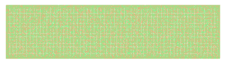
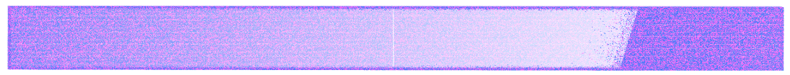

# enormous_tensors
These are very large (random) tensors made to test the computer graphics of advanced threeJS rendering methods

 calls and processes <a href="https://github.com/andrewrgarcia/enormous_tensor/blob/main/large_hollow.js">

<b>large\_hollow.js</b></a> is processed in:
 

<b>larger\_hollow.js</b></a> is processed in:

 
